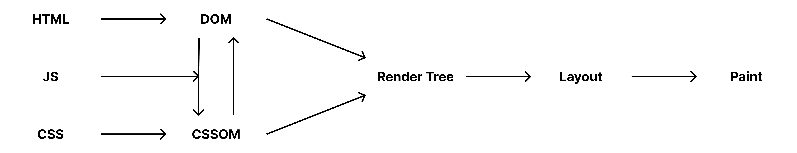
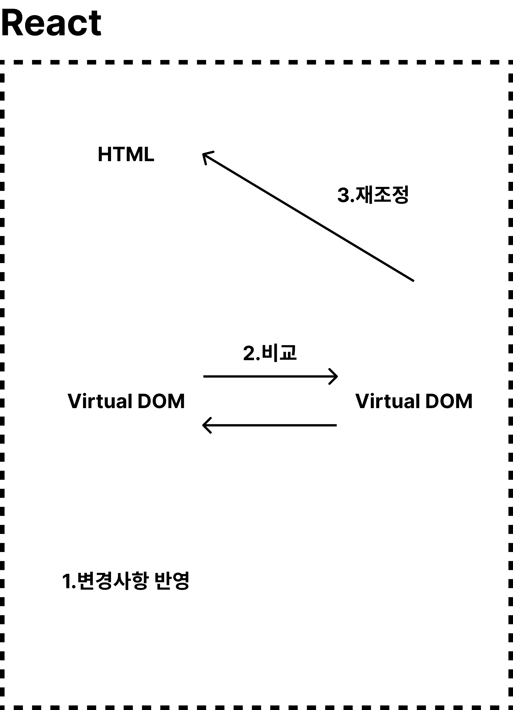

# 웹브라우저 렌더링 원리

자바스크립트로 돔을 1회라도 하게 된다면
DOM, CSSOM, RenderTree, Layout, Paint 가 전부 변경되게 된다.

이 때, Layout과 Paint를 다시 하는 것은 굉장히 많은 비용이 든다. (비용 = 시간)

Layout을 다시 그리는 작업을 Reflow라고 부르고, Paint를 다시하는 작업을 Repaint라고 부른다.

이러한 Reflow, Repain를 줄이기 위해서 개발자들은 열심히 노력해야 했다 ...!

하지만, 이것을 줄이기가 너무 어렵다 ... 그래서 등장한게 바로 React 이다!

## React가 어떻게 이것들을 줄여줄까?

## 참조

https://trustmitt.tistory.com/89
